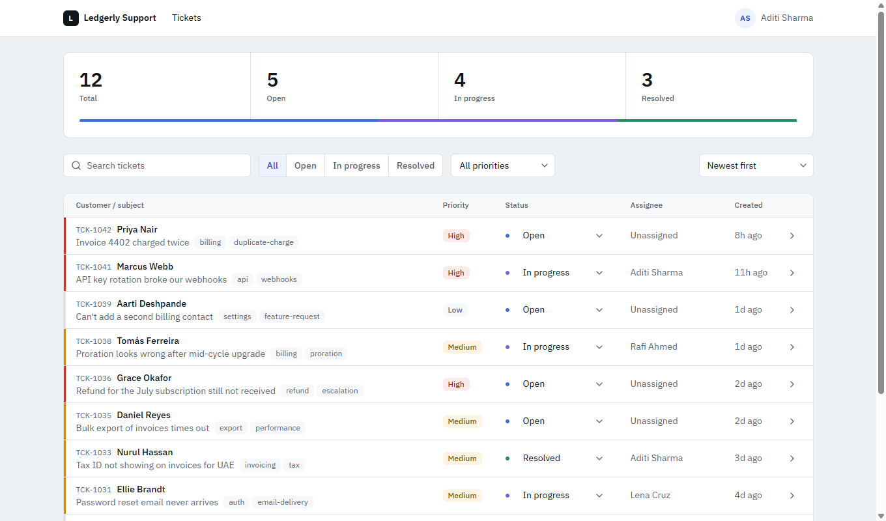
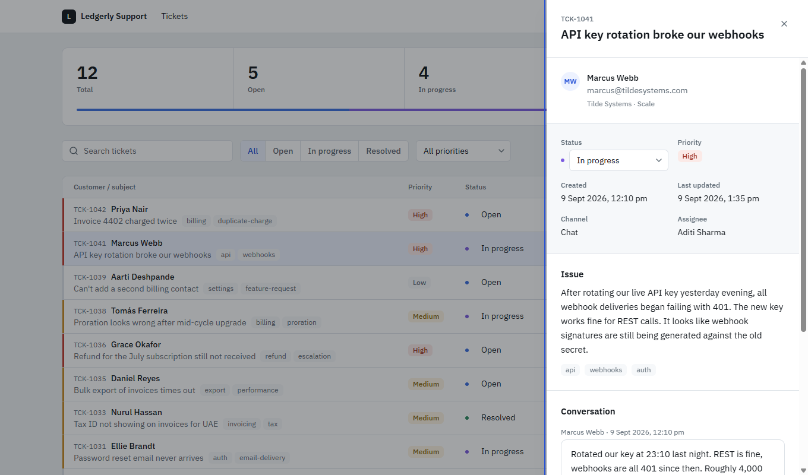

# Customer Support Dashboard

A support-team dashboard for triaging customer tickets: scan the queue, filter it, open a
ticket, move it along. Built as a technical task.

**Live:** https://customer-support-dashboard-six.vercel.app
**Repo:** https://github.com/Kunalmishra77/customer-support-dashboard





## What it does

- Queue summary with total, open, in progress and resolved counts, derived from the data rather
  than stored, plus a proportion bar showing the same numbers as widths
- Ticket list with ticket ID, customer, subject, tags, priority, status, assignee and created
  date
- Search across customer name, subject and ticket ID, debounced 250ms
- Filter by status and by priority, and sort by newest, oldest or priority - all combinable
- Change a ticket's status inline from the list or from the detail panel, optimistically
- Detail panel with customer information, the full issue, status and priority, timestamps and
  the conversation history
- Loading, error and empty states, with two distinct empty states for "no tickets" and "no
  results for these filters"
- Responsive: a table at 768px and up, cards below, and the panel becomes a full-height bottom
  sheet on mobile

## Stack

| | |
|---|---|
| React 19 + TypeScript 6 | function components and hooks only |
| Vite 8 | build tool |
| Tailwind CSS v4 | styling, tokens declared in CSS via `@theme` — there is no `tailwind.config.js` |
| Zustand 5 | ticket data, request state, optimistic mutations |
| React Router 7 | routing and URL-held view state |
| lucide-react | icons |
| oxlint | linting (came with the Vite template) |

No component library, no data-fetching library, no date library. The primitives, the async
handling and the relative-time helper are written here on purpose — that is the part the task is
actually testing.

## Running it

```bash
git clone https://github.com/Kunalmishra77/customer-support-dashboard.git
cd customer-support-dashboard
npm install
npm run dev          # http://localhost:5173
```

```bash
npm run build        # type-check (tsc -b) and production build
npm run preview      # serve the build locally - closer to production than the dev server
npm run test         # vitest, 12 tests
npm run lint
```

**To see the error state and the optimistic rollback:** create `.env.local` with
`VITE_FAIL_RATE=1` and restart the dev server. Every request then fails, so the error UI, the
Retry button and the rollback-with-toast path are all reachable. `VITE_FAIL_RATE` is unset in
production.

## Data

Tickets are served as a static JSON endpoint at `public/api/tickets.json` and fetched over HTTP
with a small artificial delay, so the loading and error states are real rather than faked in a
component. All access goes through `src/features/tickets/api/ticketsApi.ts`; no component calls
`fetch` directly.

`getTickets` takes an `AbortSignal` and the mount effect aborts on cleanup. Under React's
StrictMode the effect runs twice in development; without the abort you get a duplicate request
and a possible stale response. With it, the discarded run never reaches the network.

There is no backend, so status updates are applied client-side. `patchTicketStatus` simulates
the round trip and returns success; changes are lost on refresh. See Limitations.

## Structure

```
public/api/tickets.json      the mock endpoint
vercel.json                  SPA rewrite, excluding /api/
src/
  app/                       shell, routes, dashboard page
  components/ui/             generic primitives - no ticket knowledge
  features/tickets/
    api/                     fetch layer, ApiError, delay, failure injection
    store/                   ticket store and a small ui store for toasts
    hooks/                   stats, filters, filtered list
    lib/                     selectTickets - pure filter and sort, plus its tests
    components/              queue, filters, list, row, card, detail panel
  lib/                       constants, date helpers, cn
  types/                     the ticket model
```

`components/ui` never imports anything ticket-specific. `Badge` knows about tones; the feature
layer's `PriorityTag` is what knows that a high-priority ticket is a danger tone. Same for the
generic `Dot` and the ticket-aware `StatusDot`. That one indirection is what makes the
primitives reusable rather than just relocated.

## Decisions

**Zustand over Redux.** One async resource, one domain. Redux Toolkit would mean slices, thunks,
a provider and typed hooks for the same behaviour. Zustand is a hook over a plain object. With
multiple domains and middleware needs the trade-off flips.

**Filters and the open ticket live in the URL, not in the store.** Both are view state. Keeping
them in `?q=&status=&priority=` and `/tickets/:id` means a reload keeps your place, the back
button undoes a filter, and a filtered view can be sent to a colleague. Zustand keeps what a URL
cannot: ticket data, request status and mutations. Filter writes use `replace` so typing does
not push a history entry per keystroke; opening a ticket uses `push` and carries
`location.search` so closing the panel does not lose the filters.

**A side panel rather than a modal or a separate page.** The queue stays visible behind it,
which matches how a triage tool is actually used, and it is still route-driven so deep links
work. It is a nested route under `/`, which keeps the dashboard mounted — closing the panel does
not refetch the queue.

**Optimistic status updates.** The UI updates immediately, the request fires, and a failure
rolls back both the status and the `updatedAt` and shows a toast. Right for an action that is
low-risk, reversible and performed dozens of times an hour. Because there is a single source of
truth, changing status inside the panel updates the row behind it and the counters above it at
the same time, with no prop plumbing.

**Priority carries colour, status stays quiet.** Priority is a coloured rule on the left edge of
each row, so it is scannable without reading; status is a small neutral dot. Two urgency scales
competing for attention would make both harder to read.

The rule is paired with a text tag rather than replacing it. Colour alone would fail WCAG 1.4.1
and would leave the field invisible to a screen reader, so priority and status are also written
into each row's accessible name: *"Open ticket TCK-1042, Invoice 4402 charged twice, High
priority, Open"*.

**The row shows what the agent needs to act, not the minimum.** The ticket ID is visible
because search matches it — searching by an ID you cannot see is a dead end. Tags and assignee
fill the row at wider viewports rather than leaving it half empty; both drop out below `lg`,
where the space genuinely is not there.

**Derived data is never stored.** Stats and the filtered list are computed with `useMemo` from
the ticket array. Two sources of truth for the same number is how counts drift out of sync.

## Tests

`npm run test` - 12 tests, no browser environment needed.

Vitest is the only test dependency. Two of the three things worth testing do not need React at
all: `formatRelative` is pure and takes an injectable `now`, and the Zustand store is a plain
object outside React, so `useTicketStore.getState().updateStatus(...)` exercises the optimistic
path directly. The filtering and sorting was moved out of `useFilteredTickets` into a pure
`selectTickets` for the same reason - the hook is now a thin wrapper over a function a test can
call with an array and an object.

- `date.test.ts` - relative formatting at each boundary
- `selectTickets.test.ts` - search across all three fields, filters combining with search,
  the three sort orders, and that the input array is never mutated
- `ticketStore.test.ts` - the change lands before the request resolves; a failure restores both
  the status and `updatedAt` and raises a toast; no request fires for a no-op or an unknown id

Each test was checked by breaking the code it covers and confirming it failed - a test that
cannot fail is not a test.

## Accessibility

- Rows are keyboard operable: Tab to a row, Enter or Space opens it
- The panel is `role="dialog"` with `aria-modal`, labelled by the ticket subject; Escape and the
  scrim close it, Tab is confined to the panel, and focus returns to the row that opened it
- Body scroll is locked while the panel is open, with the scrollbar's width replaced by padding
  so the layout does not shift
- Every interactive element has a visible focus ring
- Touch targets are 44px on mobile
- `prefers-reduced-motion` is respected
- Text contrast was measured rather than eyeballed: the lowest combination in the app is 5.09:1
  against a 4.5:1 AA threshold

## AI tools used

- **Claude Code (Claude Opus 5)** — I wrote a specification first (requirements, data model,
  state design, component tree and a design system), then built against it phase by phase:
  scaffolding, primitives, the data layer and store, the queue, the detail panel, and a
  responsive/accessibility audit pass. Each phase was reviewed and committed separately, which
  is why the history reads the way it does.

I read every diff before committing it, and the decisions above are ones I can explain and
change — the specification predates the code and drove it.

## Limitations

- **Status changes are not persisted.** There is no backend; `patchTicketStatus` is simulated,
  so a refresh resets them.
- Twelve seed tickets. Filtering and search are client-side and would move server-side with real
  volume — at a few thousand rows you would paginate and filter on the server before reaching
  for virtualisation.
- Table rows are `role="button"` and contain a `<select>` for the inline status change. Nesting
  an interactive control inside a `role="button"` is an ARIA violation on paper; it behaves
  correctly in practice, and the alternative — a dedicated open-link per row — loses the
  whole-row click target the design calls for. A conscious trade-off rather than an oversight.
- Tests cover the filter/sort logic, the store's optimistic and rollback paths and the date
  helper. The components are untested - that would need a DOM environment and testing-library,
  which felt like the wrong place to spend the remaining time.
- No auth, ticket creation, assignment or reply sending — outside the brief's scope.

## What I would do next

- Component tests with testing-library, starting with the row's stopPropagation behaviour
- `localStorage` persistence of status changes, documented honestly as a workaround for having
  no backend
- Server-side search and pagination once the list grows
- Replying to a ticket, and assignment
